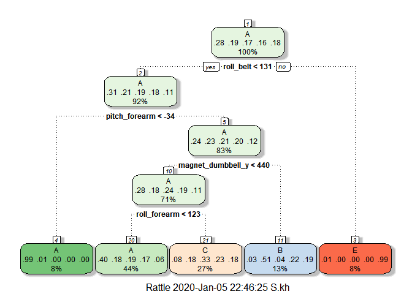

## Introduction


Using devices such as Jawbone Up, Nike FuelBand, and Fitbit it is now possible to collect a large amount of data about personal activity relatively inexpensively. These type of devices are part of the quantified self movement – a group of enthusiasts who take measurements about themselves regularly to improve their health, to find patterns in their behavior, or because they are tech geeks. One thing that people regularly do is quantify how much of a particular activity they do, but they rarely quantify how well they do it. In this project, your goal will be to use data from accelerometers on the belt, forearm, arm, and dumbell of 6 participants. They were asked to perform barbell lifts correctly and incorrectly in 5 different ways. More information is available from the website here: [http://web.archive.org/web/20161224072740/http:/groupware.les.inf.puc-rio.br/har] (see the section on the Weight Lifting Exercise Dataset).

The goal of project is to predict the manner in which they did the exercise.

## Data

The training data for this project are available here:


- [https://d396qusza40orc.cloudfront.net/predmachlearn/pml-training.csv]


The test data are available here:

- [https://d396qusza40orc.cloudfront.net/predmachlearn/pml-testing.csv]


```r
## Reading data from working directory
training <- read.csv("./pml-training.csv", na.strings = c("","#DIV/0!","NA"))
testing <- read.csv("./pml-testing.csv")
```

## Data cleaning

Removing columns with more than 75% NA 


```r
training <- training[,colMeans(is.na(training)) <= .75]
testing <- testing[,colMeans(is.na(testing)) <= .75]
str(training)
```

```
## 'data.frame':	19622 obs. of  60 variables:
##  $ X                   : int  1 2 3 4 5 6 7 8 9 10 ...
##  $ user_name           : Factor w/ 6 levels "adelmo","carlitos",..: 2 2 2 2 2 2 2 2 2 2 ...
##  $ raw_timestamp_part_1: int  1323084231 1323084231 1323084231 1323084232 1323084232 1323084232 1323084232 1323084232 1323084232 1323084232 ...
##  $ raw_timestamp_part_2: int  788290 808298 820366 120339 196328 304277 368296 440390 484323 484434 ...
##  $ cvtd_timestamp      : Factor w/ 20 levels "02/12/2011 13:32",..: 9 9 9 9 9 9 9 9 9 9 ...
##  $ new_window          : Factor w/ 2 levels "no","yes": 1 1 1 1 1 1 1 1 1 1 ...
##  $ num_window          : int  11 11 11 12 12 12 12 12 12 12 ...
##  $ roll_belt           : num  1.41 1.41 1.42 1.48 1.48 1.45 1.42 1.42 1.43 1.45 ...
##  $ pitch_belt          : num  8.07 8.07 8.07 8.05 8.07 8.06 8.09 8.13 8.16 8.17 ...
##  $ yaw_belt            : num  -94.4 -94.4 -94.4 -94.4 -94.4 -94.4 -94.4 -94.4 -94.4 -94.4 ...
##  $ total_accel_belt    : int  3 3 3 3 3 3 3 3 3 3 ...
##  $ gyros_belt_x        : num  0 0.02 0 0.02 0.02 0.02 0.02 0.02 0.02 0.03 ...
##  $ gyros_belt_y        : num  0 0 0 0 0.02 0 0 0 0 0 ...
##  $ gyros_belt_z        : num  -0.02 -0.02 -0.02 -0.03 -0.02 -0.02 -0.02 -0.02 -0.02 0 ...
##  $ accel_belt_x        : int  -21 -22 -20 -22 -21 -21 -22 -22 -20 -21 ...
##  $ accel_belt_y        : int  4 4 5 3 2 4 3 4 2 4 ...
##  $ accel_belt_z        : int  22 22 23 21 24 21 21 21 24 22 ...
##  $ magnet_belt_x       : int  -3 -7 -2 -6 -6 0 -4 -2 1 -3 ...
##  $ magnet_belt_y       : int  599 608 600 604 600 603 599 603 602 609 ...
##  $ magnet_belt_z       : int  -313 -311 -305 -310 -302 -312 -311 -313 -312 -308 ...
##  $ roll_arm            : num  -128 -128 -128 -128 -128 -128 -128 -128 -128 -128 ...
##  $ pitch_arm           : num  22.5 22.5 22.5 22.1 22.1 22 21.9 21.8 21.7 21.6 ...
##  $ yaw_arm             : num  -161 -161 -161 -161 -161 -161 -161 -161 -161 -161 ...
##  $ total_accel_arm     : int  34 34 34 34 34 34 34 34 34 34 ...
##  $ gyros_arm_x         : num  0 0.02 0.02 0.02 0 0.02 0 0.02 0.02 0.02 ...
##  $ gyros_arm_y         : num  0 -0.02 -0.02 -0.03 -0.03 -0.03 -0.03 -0.02 -0.03 -0.03 ...
##  $ gyros_arm_z         : num  -0.02 -0.02 -0.02 0.02 0 0 0 0 -0.02 -0.02 ...
##  $ accel_arm_x         : int  -288 -290 -289 -289 -289 -289 -289 -289 -288 -288 ...
##  $ accel_arm_y         : int  109 110 110 111 111 111 111 111 109 110 ...
##  $ accel_arm_z         : int  -123 -125 -126 -123 -123 -122 -125 -124 -122 -124 ...
##  $ magnet_arm_x        : int  -368 -369 -368 -372 -374 -369 -373 -372 -369 -376 ...
##  $ magnet_arm_y        : int  337 337 344 344 337 342 336 338 341 334 ...
##  $ magnet_arm_z        : int  516 513 513 512 506 513 509 510 518 516 ...
##  $ roll_dumbbell       : num  13.1 13.1 12.9 13.4 13.4 ...
##  $ pitch_dumbbell      : num  -70.5 -70.6 -70.3 -70.4 -70.4 ...
##  $ yaw_dumbbell        : num  -84.9 -84.7 -85.1 -84.9 -84.9 ...
##  $ total_accel_dumbbell: int  37 37 37 37 37 37 37 37 37 37 ...
##  $ gyros_dumbbell_x    : num  0 0 0 0 0 0 0 0 0 0 ...
##  $ gyros_dumbbell_y    : num  -0.02 -0.02 -0.02 -0.02 -0.02 -0.02 -0.02 -0.02 -0.02 -0.02 ...
##  $ gyros_dumbbell_z    : num  0 0 0 -0.02 0 0 0 0 0 0 ...
##  $ accel_dumbbell_x    : int  -234 -233 -232 -232 -233 -234 -232 -234 -232 -235 ...
##  $ accel_dumbbell_y    : int  47 47 46 48 48 48 47 46 47 48 ...
##  $ accel_dumbbell_z    : int  -271 -269 -270 -269 -270 -269 -270 -272 -269 -270 ...
##  $ magnet_dumbbell_x   : int  -559 -555 -561 -552 -554 -558 -551 -555 -549 -558 ...
##  $ magnet_dumbbell_y   : int  293 296 298 303 292 294 295 300 292 291 ...
##  $ magnet_dumbbell_z   : num  -65 -64 -63 -60 -68 -66 -70 -74 -65 -69 ...
##  $ roll_forearm        : num  28.4 28.3 28.3 28.1 28 27.9 27.9 27.8 27.7 27.7 ...
##  $ pitch_forearm       : num  -63.9 -63.9 -63.9 -63.9 -63.9 -63.9 -63.9 -63.8 -63.8 -63.8 ...
##  $ yaw_forearm         : num  -153 -153 -152 -152 -152 -152 -152 -152 -152 -152 ...
##  $ total_accel_forearm : int  36 36 36 36 36 36 36 36 36 36 ...
##  $ gyros_forearm_x     : num  0.03 0.02 0.03 0.02 0.02 0.02 0.02 0.02 0.03 0.02 ...
##  $ gyros_forearm_y     : num  0 0 -0.02 -0.02 0 -0.02 0 -0.02 0 0 ...
##  $ gyros_forearm_z     : num  -0.02 -0.02 0 0 -0.02 -0.03 -0.02 0 -0.02 -0.02 ...
##  $ accel_forearm_x     : int  192 192 196 189 189 193 195 193 193 190 ...
##  $ accel_forearm_y     : int  203 203 204 206 206 203 205 205 204 205 ...
##  $ accel_forearm_z     : int  -215 -216 -213 -214 -214 -215 -215 -213 -214 -215 ...
##  $ magnet_forearm_x    : int  -17 -18 -18 -16 -17 -9 -18 -9 -16 -22 ...
##  $ magnet_forearm_y    : num  654 661 658 658 655 660 659 660 653 656 ...
##  $ magnet_forearm_z    : num  476 473 469 469 473 478 470 474 476 473 ...
##  $ classe              : Factor w/ 5 levels "A","B","C","D",..: 1 1 1 1 1 1 1 1 1 1 ...
```
Removing first 7 columns including username and time stamp.


```r
training <- training[,-c(1:7)]
testing <- testing[,-c(1:7)]
```

## Partitioning training data set
Splitting training data set into 70% training and 30% testing.


```r
library(caret)
```

```
## Warning: package 'caret' was built under R version 3.6.2
```

```
## Loading required package: lattice
```

```
## Loading required package: ggplot2
```

```r
library(rattle)
```

```
## Warning: package 'rattle' was built under R version 3.6.2
```

```
## Rattle: A free graphical interface for data science with R.
## Version 5.3.0 Copyright (c) 2006-2018 Togaware Pty Ltd.
## Type 'rattle()' to shake, rattle, and roll your data.
```

```r
set.seed(2020)
intrain <- createDataPartition(y= training$classe, p = 0.7 , list = F)
trainingset <- training[intrain,]
testingset <- training[-intrain,]
```
## Machine Learning Algorithms

In this section we try to fit our model with different algorithms such as DT (Decision Tree) and RF (Random Forest).

### Decision Tree


```r
## Decision Tree
fit1 <- train(classe~. , data = trainingset, method = "rpart")
fancyRpartPlot(fit1$finalModel)
```

<!-- -->

Predicting the model on our testing set.


```r
predictfit1 <- predict(fit1, testingset)
confusionMatrix(predictfit1, testingset$classe)
```

```
## Confusion Matrix and Statistics
## 
##           Reference
## Prediction    A    B    C    D    E
##          A 1529  476  463  441  144
##          B   21  378   42  173  150
##          C  123  285  521  350  292
##          D    0    0    0    0    0
##          E    1    0    0    0  496
## 
## Overall Statistics
##                                          
##                Accuracy : 0.4969         
##                  95% CI : (0.484, 0.5097)
##     No Information Rate : 0.2845         
##     P-Value [Acc > NIR] : < 2.2e-16      
##                                          
##                   Kappa : 0.3425         
##                                          
##  Mcnemar's Test P-Value : NA             
## 
## Statistics by Class:
## 
##                      Class: A Class: B Class: C Class: D Class: E
## Sensitivity            0.9134  0.33187  0.50780   0.0000  0.45841
## Specificity            0.6381  0.91867  0.78391   1.0000  0.99979
## Pos Pred Value         0.5008  0.49476  0.33164      NaN  0.99799
## Neg Pred Value         0.9488  0.85140  0.88294   0.8362  0.89124
## Prevalence             0.2845  0.19354  0.17434   0.1638  0.18386
## Detection Rate         0.2598  0.06423  0.08853   0.0000  0.08428
## Detection Prevalence   0.5188  0.12982  0.26695   0.0000  0.08445
## Balanced Accuracy      0.7757  0.62527  0.64585   0.5000  0.72910
```

The accuracy of the model is about 49.69% and the estimate out of sample error is about 50.31 for DT.

### Random Forest


```r
fit2 <- train(classe~., data = trainingset, method = "rf", ntree = 200, trControl = trainControl(method = "cv",5))
```

Predicting the model on our testing set.


```r
predictfit2 <- predict(fit2, testingset)
confusionMatrix(predictfit2,testingset$classe)
```

```
## Confusion Matrix and Statistics
## 
##           Reference
## Prediction    A    B    C    D    E
##          A 1672   11    0    0    0
##          B    0 1125   11    0    6
##          C    1    3 1006    4    4
##          D    0    0    9  959    0
##          E    1    0    0    1 1072
## 
## Overall Statistics
##                                           
##                Accuracy : 0.9913          
##                  95% CI : (0.9886, 0.9935)
##     No Information Rate : 0.2845          
##     P-Value [Acc > NIR] : < 2.2e-16       
##                                           
##                   Kappa : 0.989           
##                                           
##  Mcnemar's Test P-Value : NA              
## 
## Statistics by Class:
## 
##                      Class: A Class: B Class: C Class: D Class: E
## Sensitivity            0.9988   0.9877   0.9805   0.9948   0.9908
## Specificity            0.9974   0.9964   0.9975   0.9982   0.9996
## Pos Pred Value         0.9935   0.9851   0.9882   0.9907   0.9981
## Neg Pred Value         0.9995   0.9970   0.9959   0.9990   0.9979
## Prevalence             0.2845   0.1935   0.1743   0.1638   0.1839
## Detection Rate         0.2841   0.1912   0.1709   0.1630   0.1822
## Detection Prevalence   0.2860   0.1941   0.1730   0.1645   0.1825
## Balanced Accuracy      0.9981   0.9921   0.9890   0.9965   0.9952
```

Clearly the Random Forest model is superior with 99.13% accuracy and the estimate out of sample error of 0.87%.

## Predicting the manner of exercise on Test data set

For this prediction we are going to use the random forest model.


```r
predictmanner <- predict(fit2, testing)
predictmanner
```

```
##  [1] B A B A A E D B A A B C B A E E A B B B
## Levels: A B C D E
```
